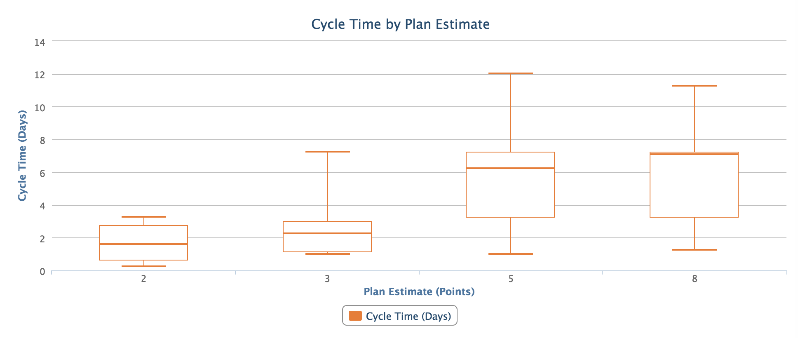

estimation-calibration
=========================

## Overview

Compare a Project's story plan estimates against their cycle times. For each plan estimate, you will see a box-plot for how many days it took to complete stories of that estimate. Only business days are counted, to the nearest quarter day.