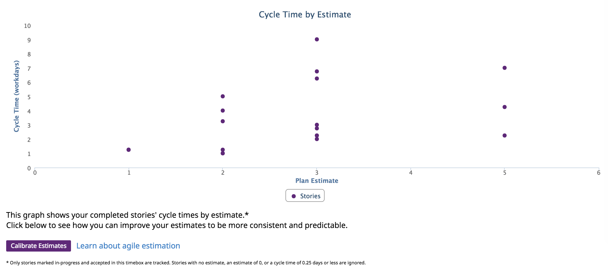
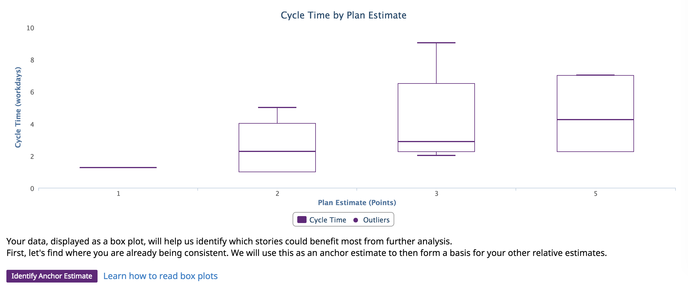
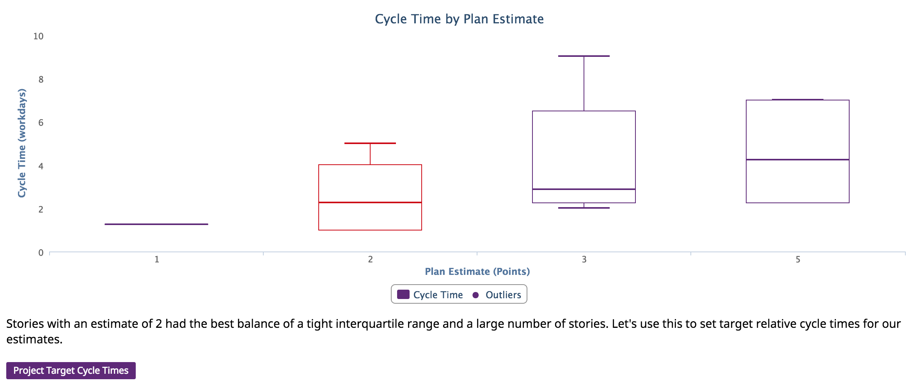
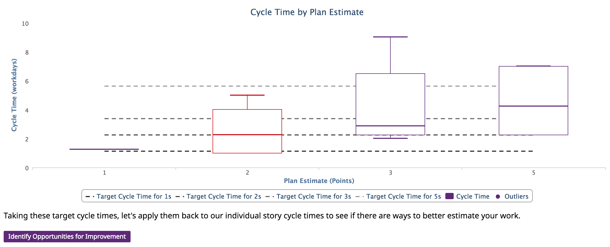
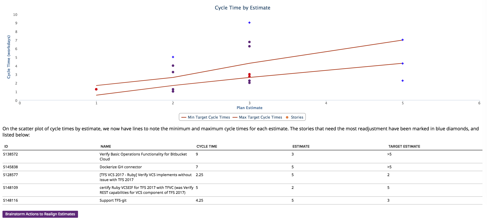
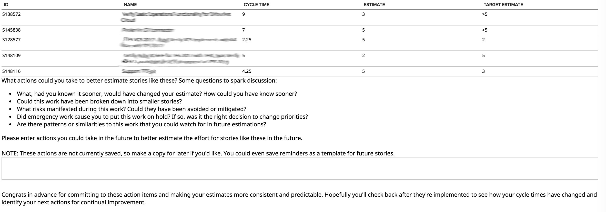

estimation-calibration
=========================

## Overview

Has your Team had troubles consistently and predictably delivering work? Do estimates seem like a shot in the dark, having no bearing on how quickly a work item is delivered? Do you need actionable data to help guide your Team to the next improvements to be as high performing as they can be? Well then, this app is for you!

The Estimation Calibration app walks you through a data analysis of your Team's cycle times by plan estimate. To start, the app shows your Team's cycle times for each estimate:

You can then begin to calibrate your estimates by clicking the button to start, or get help along the way. The app next uses a box plot to visualize the distribution of cycle times for each estimate:

Next, the app identifies your Team's current success by ranking each estimate by how consistent the cycle times are. The most consistent estimate becomes the anchor to set ideal cycle times for each estimate:

You can then see how these ideal cycle times compare to each box plot:

Using these ideals, we look again at your original data to see how each work item aligns to the target ideal zone for cycle times. The top 5 misaligned work items are highlighted and put in a table. This helps your Team focus on the types of work items that would get the most benefit from further calibration:

Finally, the app guides your Team in identifying action items that could lead to more consistent estimation in the future:

Hopefully your Team finds this app useful! Any feedback and suggestions for enhancement are welcome! I'd also love to hear other ideas you might have for this style of app where data is used to guide a Team towards their next big performance improvement.